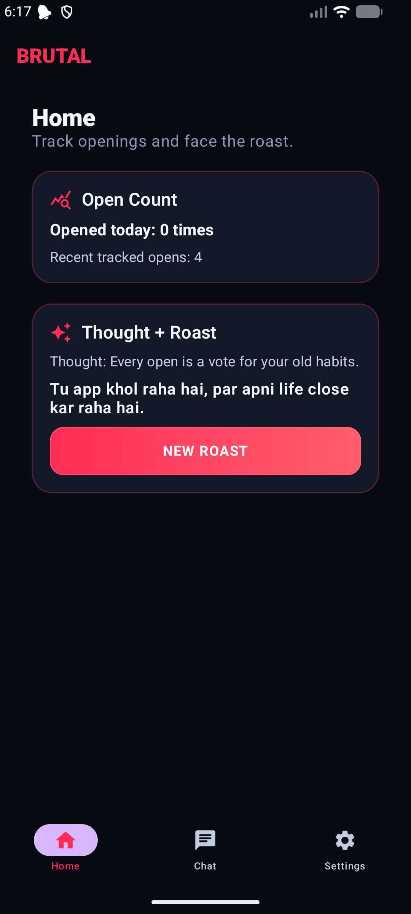
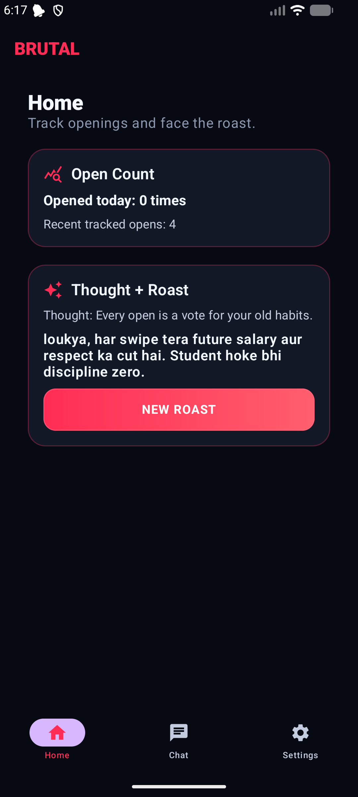
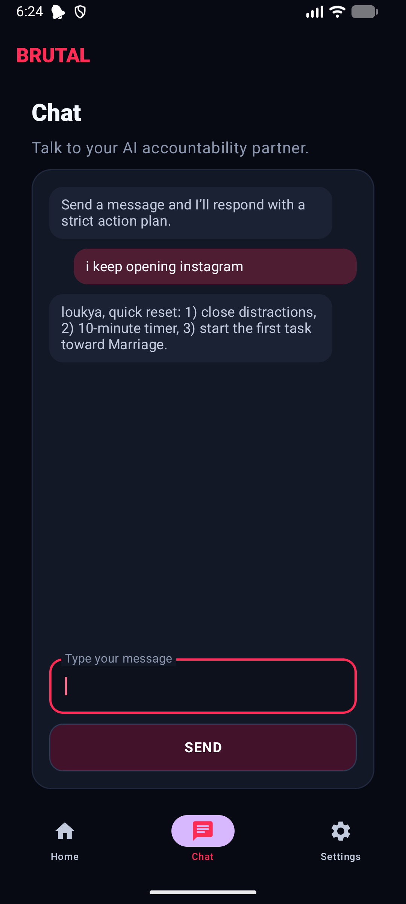
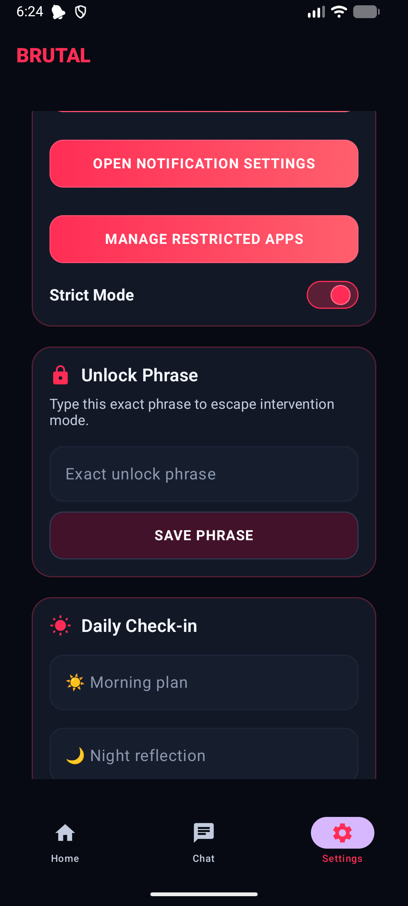
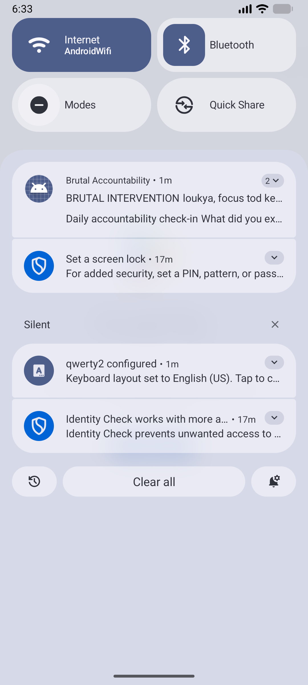

# MrBully

A **brutal Android accountability app** that uses AI interventions and strict phrase-based unlocks to stop distracting app usage. Designed to enforce digital discipline through aggressive but safe intervention mechanics.

## ✨ Features

- 📝 **Deep Onboarding Profile** — Personalized setup with dynamic follow-up questions to understand user habits and goals
- 🚧 **App Restriction Selection** — Choose which distracting apps to block
- 🔍 **Foreground App Monitoring** — Uses Android Accessibility Service to detect app usage
- 🔒 **Intervention Lock Screen** — Exact phrase unlock required to dismiss the block
- 🤖 **AI Intervention Lines** — LLM-generated personalized "roast" messages via Groq, with offline Hinglish fallbacks when no key is set
- 🗣️ **Voice Interventions** — Optional Groq TTS audio roasts (falls back to device text-to-speech)
- 💬 **AI Accountability Partner Chat** — Strict, action-oriented chat companion that knows your profile and recent violations
- ⏰ **Daily Check-in Notifications** — WorkManager-scheduled reminders with local persistence
- 🔐 **Secure API Key Storage** — Keys encrypted with Android Keystore (AES/GCM)

## 📱 Screenshots

| Home | AI Roast | AI Partner Chat |
|------|----------|-----------------|
|  |  |  |

| Settings | Live Intervention |
|----------|-------------------|
|  |  |

🎬 **Full demo video** (onboarding → roast → chat → live intervention when a restricted app opens): [`docs/demo.mp4`](docs/demo.mp4)

## 🛠️ Tech Stack

| Technology | Purpose |
|-----------|--------|
| Kotlin + Jetpack Compose | Android UI |
| Room | Local database |
| WorkManager | Daily check-in scheduling |
| DataStore | App settings persistence |
| OkHttp | Groq API calls |
| Groq API | LLM intervention messages + TTS (optional) |

## 🚀 Getting Started

1. Open this folder in **Android Studio**
2. Let Gradle sync and install SDK 35
3. Run on Android device/emulator (API 26+)
4. Complete onboarding, select restricted apps
5. Open **Accessibility Settings** and enable the service for this app

### Building from the CLI

```bash
./gradlew :app:assembleDebug          # debug APK
./gradlew :app:testDebugUnitTest      # unit tests
```

A JDK 17+ is required. Point `ANDROID_HOME` at your Android SDK if it is not auto-detected.

## 🤖 Groq Setup (Optional)

The app works fully offline using built-in fallback intervention lines. For personalized AI lines:

1. Get a free API key at [console.groq.com](https://console.groq.com)
2. Provide it in one of two ways:
   - Paste it in the app's **Settings → Groq API Key** field (stored encrypted), or
   - Bake in a default at build time via `GROQ_API_KEY` as a `gradle.properties` entry in `~/.gradle/gradle.properties`, an environment variable, or a `local.properties` entry. A baked-in key is only imported on first launch and never overwrites a user-saved key.
3. For voice interventions, accept the terms of use for the TTS voice model (`canopylabs/orpheus-v1-english`) in the Groq console once; otherwise the app falls back to device TTS automatically.

## ⚠️ Notes

- iOS is not supported in this MVP
- Currently uses one punishment mode: strict intervention phrase unlock
- Tone is intentionally strict but avoids any unsafe or self-harm content
- Tracked violation events are retained locally for 30 days

## 📄 License

MIT
