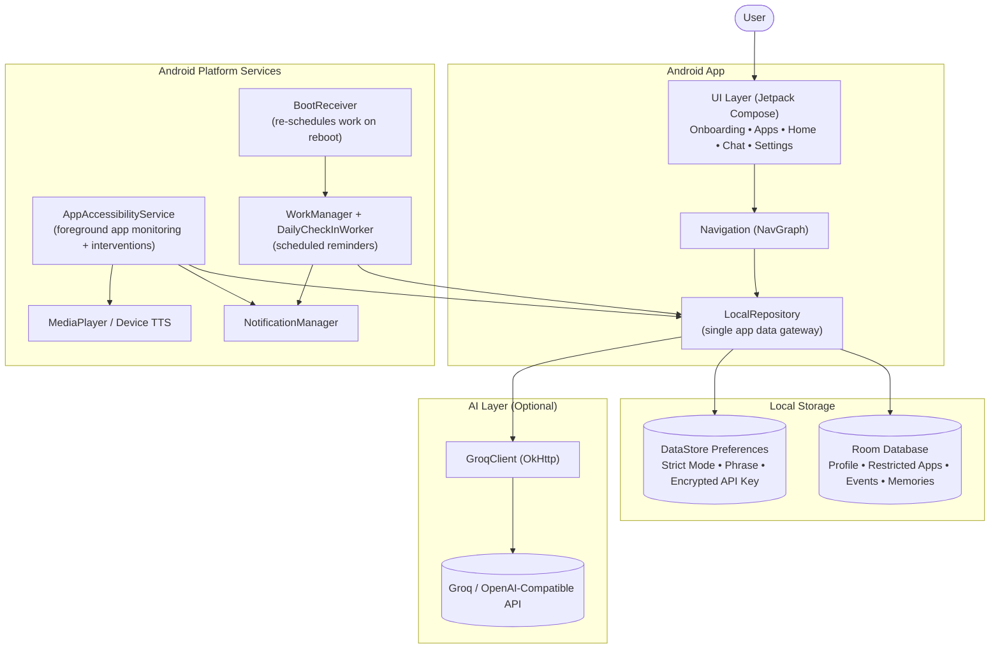

# MrBully

A **brutal Android accountability app** that uses AI interventions and strict phrase-based unlocks to stop distracting app usage. Designed to enforce digital discipline through aggressive but safe intervention mechanics.

## ✨ Features

- 📝 **Deep Onboarding Profile** — Personalized setup to understand user habits and goals
- 🚧 **App Restriction Selection** — Choose which distracting apps to block
- 🔍 **Foreground App Monitoring** — Uses Android Accessibility Service to detect app usage
- 🔒 **Intervention Lock Screen** — Exact phrase unlock required to dismiss the block
- ⏰ **Daily Check-in Notifications** — WorkManager-scheduled reminders with local persistence
- 🤖 **AI Intervention Lines** — Optional LLM-generated personalized intervention messages (OpenAI API)

## 🛠️ Tech Stack

| Technology | Purpose |
|-----------|--------|
| Kotlin + Jetpack Compose | Android UI |
| Room | Local database |
| WorkManager | Daily check-in scheduling |
| DataStore | App settings persistence |
| OkHttp | LLM API calls |
| OpenAI API | AI intervention messages (optional) |

## 🏗️ Architecture

## 🚀 Getting Started

1. Open this folder in **Android Studio**
2. Let Gradle sync and install SDK 35
3. Run on Android device/emulator (API 26+)
4. Complete onboarding, select restricted apps
5. Open **Accessibility Settings** and enable the service for this app

## 🤖 LLM Setup (Optional)

- Save your OpenAI API key in the app dashboard
- If no key is set, the app uses a local fallback intervention message

## ⚠️ Notes

- iOS is not supported in this MVP
- Currently uses one punishment mode: strict intervention phrase unlock
- Tone is intentionally strict but avoids any unsafe or self-harm content

## 📄 License

MIT
